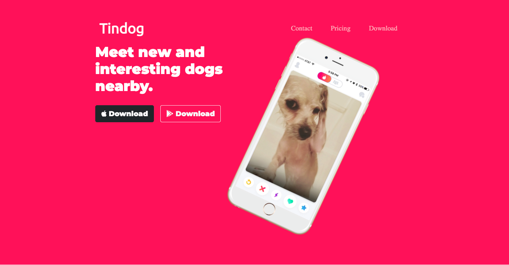
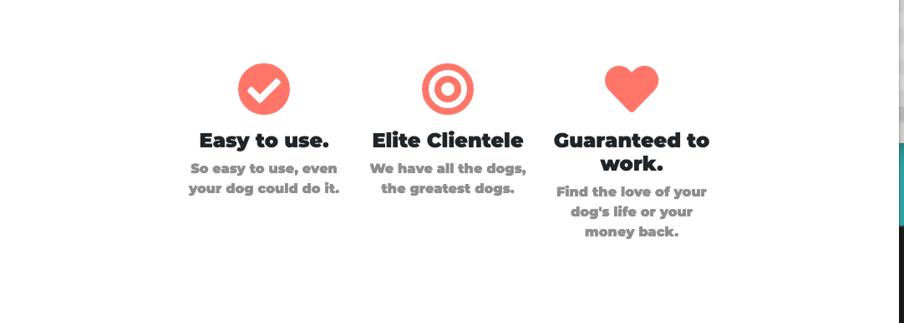
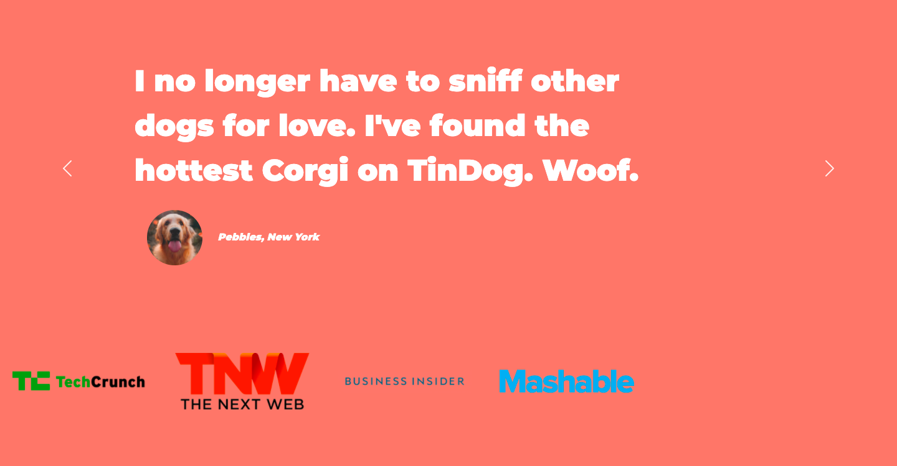
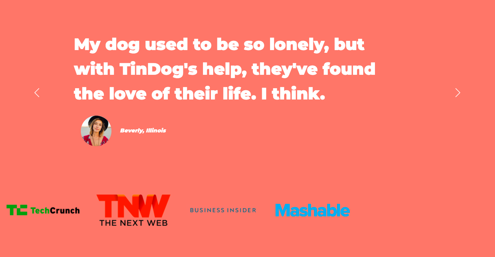
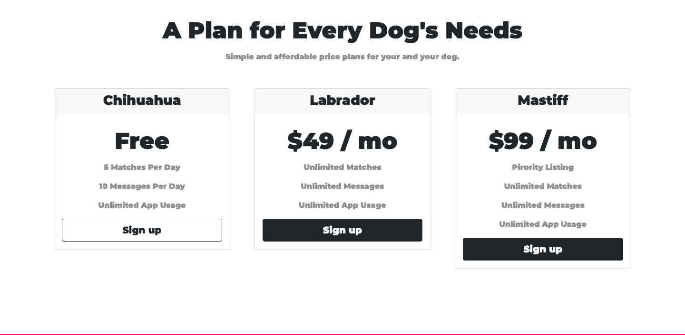
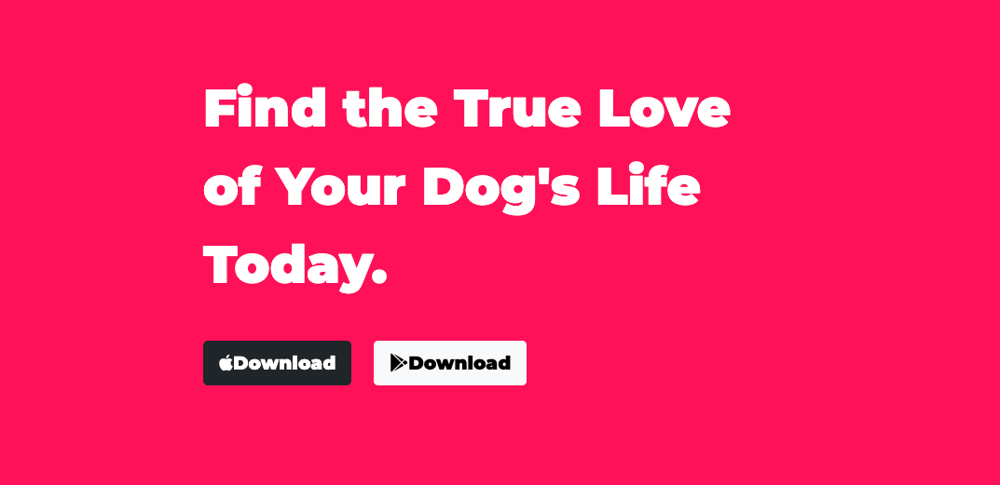

# Tin-Dog

## Application description:

A mock dating site for dogs to meet other dogs. It it includes 5 main sections throughout  the index homepage and a footer at the end. The website was styled using HTML, CSS, and Bootsstrap.
 

 ## Click [here](https://brianlevin.github.io/Tin-Dog/) for the live app. 
 
 This is the home screen with navigation links that go directly to each section when clicked:
 
 
 
 These are breif bullets points explaing the benefits of the website:
 

  
  This is the testimonials section of the website: 
 
  
   
  
 This section displays  the type of plans that can be chosen
  
  
  
  The final section shows where the app can be downloaded using apple or samsung:
    
       
    
    
## Libraries and Frameworks:

- HTML
- CSS
- Bootstrap

## Email:

bml201095@gmail.com
